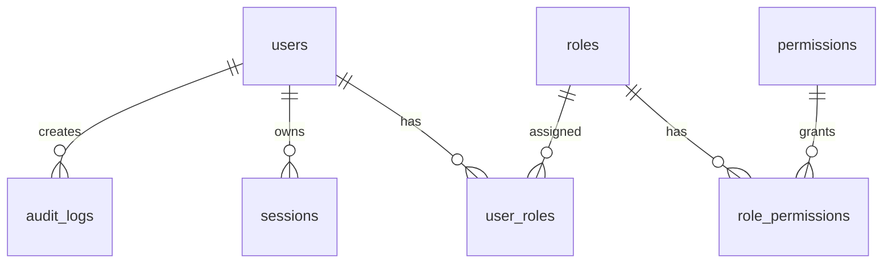
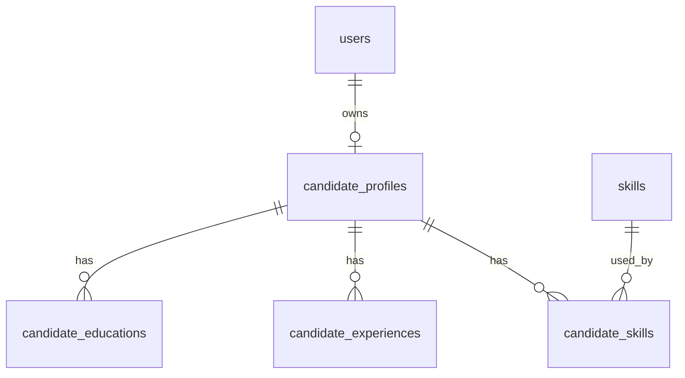
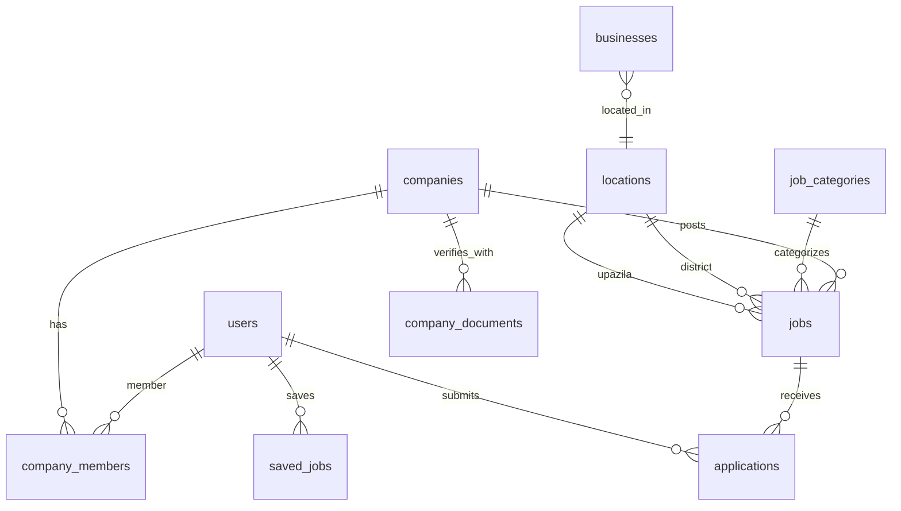
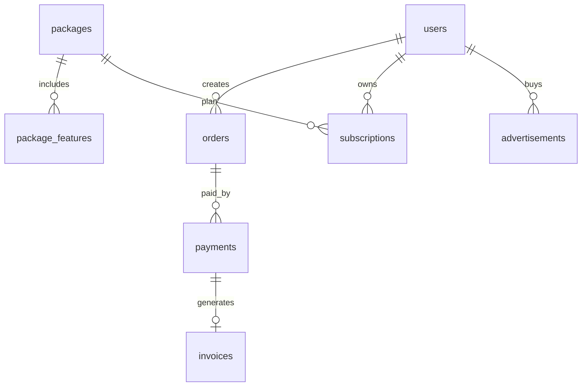
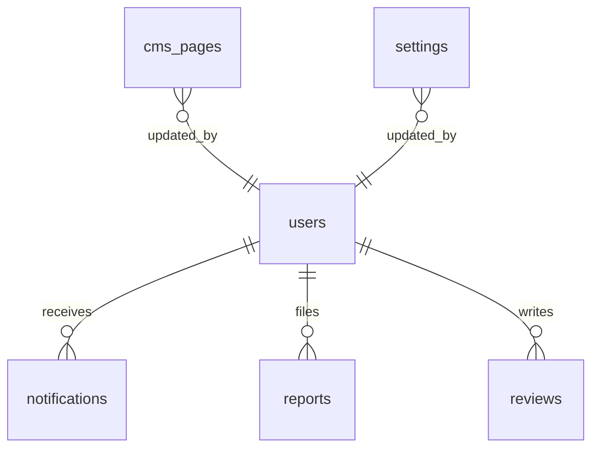

# Data model (ERD)

The data lives in **Cloud Firestore**. Collections and their relations are defined in
`backend/src/database/models.ts`, which drives the Prisma-compatible query layer
(`backend/src/database/orm.ts`). Firestore is schemaless, so the diagrams below describe
the logical document relationships (each box is a collection; ids are document ids and
foreign keys are plain fields). Join "tables" (e.g. `user_roles`, `job_skills`) are
collections keyed by a deterministic composite id.

## Core identity and RBAC

## Candidate and skills

## Company, business and jobs

## Payment and monetization

## Admin/CMS/notifications

## Location strategy

Locations are database-driven. Initial seed data contains Bogura and Joypurhat districts and upazilas. Application logic queries the `locations` table; it does not hard-code location names.
